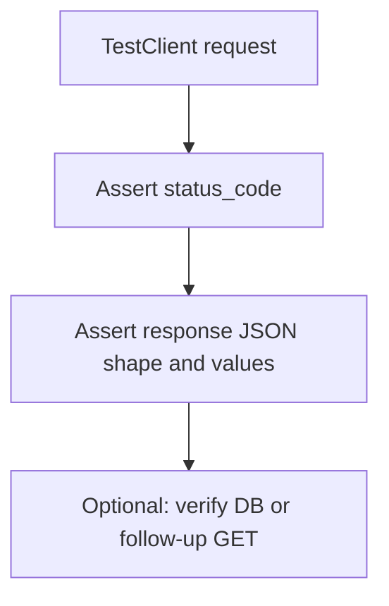
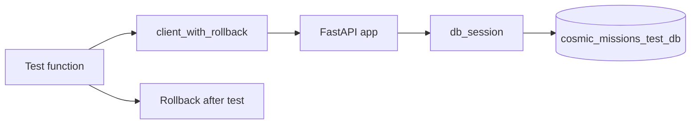

# API Testing Checklist (pytest + FastAPI)

A practical pytest checklist for testing your FastAPI cosmic missions API, mapped to what you already have and what to add next as you learn.

**Next:** see [upgrade-roadmap.md](upgrade-roadmap.md) for APIRouter notes, the pytest upgrade path (test DB, rollback, CI), and the final Azure deployment step.

For every endpoint, think in three layers: **did the HTTP response behave correctly?**, **is the JSON body right?**, and **did side effects happen** (DB changed, etc.)?



---

## 1. Always check the status code first

The status code is the contract. Clients depend on it more than the body.

| Scenario | Expected code | Your API example |
|----------|---------------|------------------|
| Success (read) | `200` | `GET /cosmic-missions` |
| Success (create) | `200` or `201` | `POST /cosmic-missions` (FastAPI returns `200` by default unless you set `status_code=201`) |
| Not found | `404` | `GET /cosmic-missions/999999` |
| Conflict | `409` | Duplicate `mission_id` on POST |
| Bad input | `422` | Missing required field, wrong type (`mission_id: "abc"`) |

**Pattern** (use the `client_with_rollback` fixture from `conftest.py`):

```python
response = client_with_rollback.get("/cosmic-missions/999999")
assert response.status_code == 404
```

Add the same pattern for every error path you care about.

---

## 2. Check the response body (not just status)

A `200` with wrong JSON is still a bug.

**What to assert:**

- **Exact match** for simple responses: `assert response.json() == "This is a test"`
- **Key fields** for objects: `assert data["mission_id"] == 1`
- **Shape**: required keys exist — `assert "mission_name" in data`
- **Types**: `assert isinstance(data, list)`, `assert data["telemetry_data"] is None`
- **Error detail**: `assert response.json()["detail"] == "Mission not found"`

**For list endpoints** (`GET /cosmic-missions`, `GET /cosmic-missions/success`):

- Returns a list (`isinstance(..., list)`)
- Filter works: every item has `is_successful is True` for the success route
- Empty list is valid (`[]`) — don't assume `len > 0` unless you control test data

---

## 3. Test each HTTP method and route

| Route | Happy path | Error paths worth testing |
|-------|------------|---------------------------|
| `GET /` | `200`, body | — |
| `GET /cosmic-missions` | `200`, list shape | — |
| `GET /cosmic-missions/success` | `200`, all `is_successful` | — |
| `GET /cosmic-missions/{id}` | `200`, correct `mission_id` | `404` missing ID |
| `GET /cosmic-missions/{id}/telemetry` | `200`, dict or `null` | `404` missing ID |
| `POST /cosmic-missions` | `200`, returned object matches input | `409` duplicate, `422` bad body |
| `PUT /cosmic-missions/{id}` | `200`, fields updated | `404` missing ID |
| `DELETE /cosmic-missions/{id}` | `200`, message | `404` missing ID; follow-up GET returns `404` |

---

## 4. Test request validation (422)

Pydantic validates the body before your handler runs. These never hit your DB — fast, high-value tests.

Examples for `CosmicMissionCreate`:

- Omit required `mission_name` → `422`
- `mission_id` as string → `422`
- Invalid date format → `422`
- `telemetry_data: null` → should **pass** (`200`), since your schema allows it

```python
response = client_with_rollback.post("/cosmic-missions", json={"mission_id": 999})
assert response.status_code == 422
```

---

## 5. Test side effects (when writes matter)

For POST, PUT, DELETE, a status code alone isn't enough — verify the change stuck.

**Pattern: arrange → act → assert via another request**

```python
# POST a new mission with a unique ID
create = client_with_rollback.post("/cosmic-missions", json={...})
assert create.status_code == 200

# GET it back
got = client_with_rollback.get(f"/cosmic-missions/{unique_id}")
assert got.status_code == 200
assert got.json()["mission_name"] == "..."
```

For DELETE (within the same test — rollback cleans up automatically):

```python
client_with_rollback.delete(f"/cosmic-missions/{id}")
assert client_with_rollback.get(f"/cosmic-missions/{id}").status_code == 404
```

---

## 6. Test edge cases your schema allows

Your API explicitly allows optional/null telemetry. Worth one targeted test:

- Create mission with `"telemetry_data": null`
- `GET /cosmic-missions/{id}/telemetry` → `200` with body `null`

---

## 7. Structure tests for readability (Arrange-Act-Assert)

```python
def test_get_mission_not_found(client_with_rollback):
    # Arrange — nothing needed

    # Act
    response = client_with_rollback.get("/cosmic-missions/999999")

    # Assert
    assert response.status_code == 404
    assert response.json()["detail"] == "Mission not found"
```

Name tests after **behavior**, not implementation: `test_create_duplicate_mission_returns_409` is a good name; `test_db_query` is not.

---

## 8. Know what you're testing against (important for your project)

Your tests use `TestClient(app)` with a **separate test database** (`TEST_DATABASE_URL` → `cosmic_missions_test_db`) and **per-test transaction rollback**.

What that means in practice:

- Tests do **not** touch your dev database (`DATABASE_URL` → `cosmic_missions_db`)
- Each test runs inside an outer transaction; `db_session` rolls it back when the test ends
- Route handlers still call `db.commit()`, but savepoints prevent those commits from persisting past the test
- Fixtures create data via POST; you do **not** need `DELETE` teardown in fixtures anymore
- `client_with_rollback` is the shared fixture — inject it into every test that hits the API



**If a test fails with `409 Conflict` on setup**, leftover rows from an earlier run (before rollback was wired) may still be in the test DB. One-time fix:

```bash
docker exec -it fastapi_postgres_db psql -U postgres -d cosmic_missions_test_db -c \
  "TRUNCATE TABLE cosmic_missions;"
```

---

## 9. What to prioritize (learning order)

1. **Status codes** on happy + error paths (`404`, `409`, `422`)
2. **Response JSON** — key fields and error `detail`
3. **One full CRUD round-trip** (create → get → update → delete) — see `test_cosmic_missions_roundtrip.py`
4. **Validation tests** (`422`) — no DB writes needed for invalid bodies, very reliable
5. **Edge cases** (null telemetry, empty list)
6. **Next up:** test markers, coverage, CI — see [upgrade-roadmap.md](upgrade-roadmap.md) Step 7
7. **Later:** foreign keys and related tables (e.g. `crew_members` → `cosmic_missions`) — Step 8
8. **Final:** deploy API + Postgres to Azure — Step 9

---

## 10. What not to over-test

- Don't re-test FastAPI or Pydantic internals
- Don't assert every field on every endpoint — pick the fields that matter
- Don't duplicate the same `404` test for every endpoint if they share identical logic (one per route is enough while learning)

---

## 11. Foreign keys (when you add related tables)

Once you move beyond a single `cosmic_missions` table, tests need to respect **parent → child** order.

**Arrange parent first:**

```python
def test_add_crew_member(client_with_rollback, apollo_11_mission):
    response = client_with_rollback.post(
        f"/cosmic-missions/{apollo_11_mission['mission_id']}/crew",
        json={"name": "Neil Armstrong", "role": "Commander"},
    )
    assert response.status_code == 200
    assert response.json()["mission_id"] == apollo_11_mission["mission_id"]
```

**Error paths to cover:**

| Test | Assert |
|------|--------|
| Child for missing parent | `404` if route checks mission exists first |
| Delete parent with `ON DELETE CASCADE` | Child rows gone; nested GET empty or `404` |
| Delete parent with `ON DELETE RESTRICT` | `409`/`400` if children still exist |

Rollback still cleans up both tables — FK constraints do not block rollback inside your test transaction.

See [upgrade-roadmap.md](upgrade-roadmap.md) Step 8 for the full learning path.

---

## 12. Azure deployment (final step)

Local pytest and Azure production are **different environments**:

| | Local / CI | Azure production |
|---|------------|------------------|
| API | `TestClient` / `uvicorn` on your machine | App Service URL (`*.azurewebsites.net`) |
| Database | Docker or CI Postgres container | PostgreSQL Flexible Server |
| Config | `.env` / workflow `env:` | App Service Application settings |
| Tests | `pytest` with `TEST_DATABASE_URL` | Run in CI only — not against prod DB |

Before calling Azure "done", smoke-test the deployed API the same way you test locally:

```bash
curl https://<your-app>.azurewebsites.net/cosmic-missions
```

Use `/docs` for interactive checks, then automate deploy + test in GitHub Actions (Step 7 + Step 9).

See [upgrade-roadmap.md](upgrade-roadmap.md) Step 9 for database setup, `sslmode=require`, startup commands, and CI/CD.

---

You already have **37 tests** across GET, POST, PUT, PATCH, DELETE, and roundtrip files. Good next additions:

1. `@pytest.mark.integration` / `@pytest.mark.unit` markers — see upgrade roadmap Step 7
2. `pytest-cov` to find untested branches in `routers.py`
3. GitHub Actions CI with Postgres service container
4. Foreign keys and a child table (e.g. crew members per mission) — Step 8
5. Deploy to Azure (App Service + PostgreSQL Flexible Server) — Step 9
6. `status_code=201` on POST if you polish the API contract

Run the suite with:

```bash
pytest tests/ -v
```

Or a single file:

```bash
pytest tests/test_cosmic_missions_get.py -v
```
